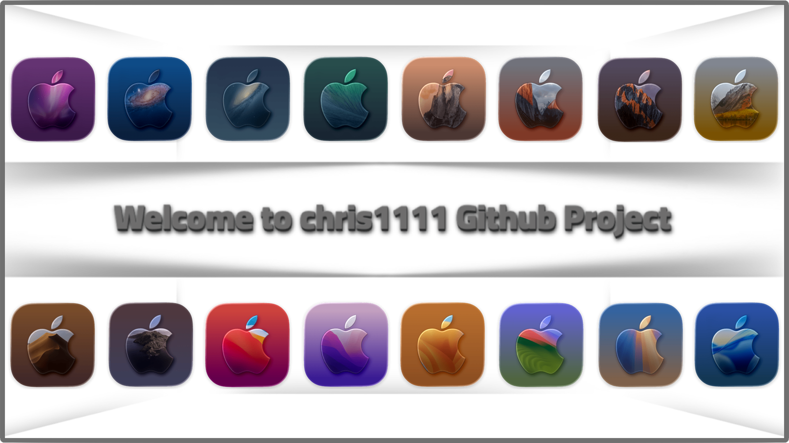
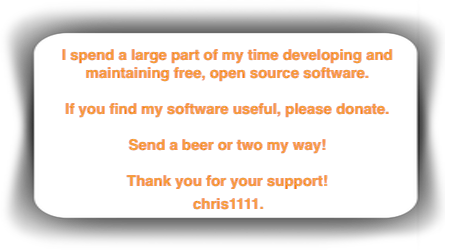

  
  
  

  

### Visit my Page ➡︎ [Github Profile](https://chris1111.github.io/chris1111/)

---

<h4 align="center">Hi there 😄 I am passionate about Apple and I have several projects on which I spend time 😎</h4>

  

---

  

---

### 🛠 Tech Stack

  
  

## 🚀 Pinned Repositories

macOS Utilities

[Background-Resizer](https://github.com/chris1111/Background-Resizer)|[Workshop-Layered-Image](https://github.com/chris1111/Workshop-Layered-Image-Studio)|[Icon-Studio](https://github.com/chris1111/Icon-Studio)|[AssetsCar-Builder](https://github.com/chris1111/AssetsCar-Builder)
-|-|-|-
|||

[Chameleon](https://github.com/chris1111/Chameleon)|[OpenCore-Creator](https://github.com/chris1111/OpenCore-Creator)|[Apple-Create-Install-Media](https://github.com/chris1111/Apple-Create-Install-Media)|[Clover-Duet](https://github.com/chris1111/Clover-Duet)
-|-|-|-
|||

[HP EliteBook 840 G4](https://github.com/chris1111/HP-EliteBook-840-G4)|[MacEFIMounter](https://github.com/chris1111/MacEFIMounter)|[Dell-Optiplex-790](https://github.com/chris1111/Dell-Optiplex-790)|[Snow-Leopard-DVD-Creator](https://github.com/chris1111/Snow-Leopard-DVD-Creator)
-|-|-|-
|||

[Wireless USB BigSur Adapter](https://github.com/chris1111/Wireless-USB-Big-Sur-Adapter)|[OpenCanopy Generator](https://github.com/chris1111/OpenCanopy-Generator)|[Themes OpenCore](https://github.com/chris1111/My-Simple-OC-Themes)|[Lion-DVD-Creator](https://github.com/chris1111/Lion-DVD-Creator)
-|-|-|-
|||

[WIFI Mediatek macOS](https://github.com/chris1111/D-LinkUtility-Package)|[HP Probook Elitebook macOS OC](https://github.com/chris1111/HP-Probook-EliteBook-Package-Creator-OC)|[IconSet-Tahoe-Style-Linux-Mac](https://github.com/chris1111/IconSet-Tahoe-Style-Linux-Mac)|[Create-Windows-USB](https://github.com/chris1111/Create-Windows-USB)
-|-|-|-
|||

[Linux-Tahoe-Style-Disk](https://github.com/chris1111/Linux-Tahoe-Style-Disk)|[Gatekeeper Tools](https://github.com/chris1111/Gatekeeper-Tools)|[Wimlib imagex Packager](https://github.com/chris1111/Wimlib-Imagex-Package)|[Softwareupdate full installer](https://github.com/chris1111/Softwareupdate-full-installer)
-|-|-|-
|||

[SF-Symbols-Composer-PNG](https://github.com/chris1111/SF-Symbols-Composer-PNG)|[CreateApp-Platypus](https://github.com/chris1111/CreateApp-Platypus)|[Compress-PNG](https://github.com/chris1111/Compress-PNG)|[Download-macOS](https://github.com/chris1111/Download_Install_macOS)
-|-|-|-
|||

### 🏆 Achievements

🌟 Arctic Code Vault &nbsp;·&nbsp; ⚡ Pull Shark &nbsp;·&nbsp; 🎯 Galaxy Brain &nbsp;·&nbsp; 💎 YOLO

---
**🔥 Longest Streak: 127 days**

---

## 📈 Contribution Activity

  
  
🔥 Every square is a day of code!

---

## ☕ Support

If you find my projects useful, feel free to support my work — thank you! 🙏

  

### 📌  Make a donation and support the projects ➤ 

---

  
  

  © 2026 chris1111 — Built with ❤️ 🍎

